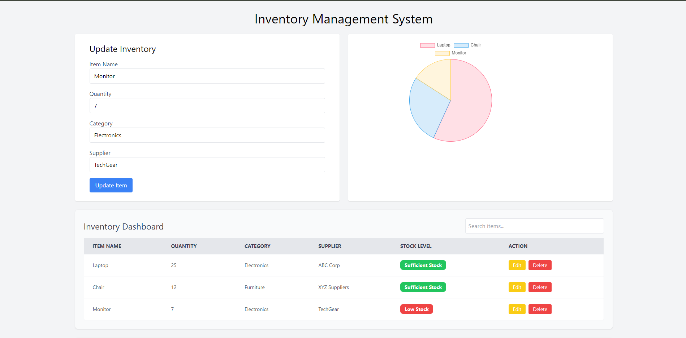
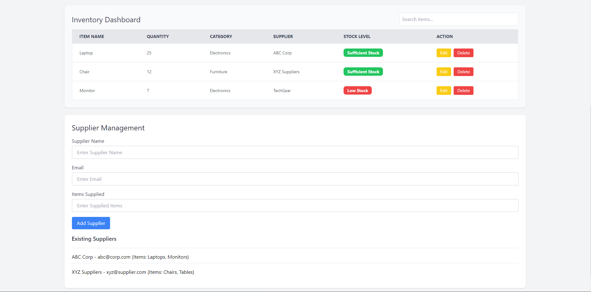

# Inventory Management - (Create React App)

The Inventory Dashboard is a responsive web application that helps manage and track items in inventory, allowing users to search, edit, and delete items seamlessly. This project provides an intuitive interface for users to view important inventory details such as item name, quantity, category, supplier, and stock levels. this website is available on : https://inventory-management-five-gamma.vercel.app/




## Features
- Search Functionality: Users can filter inventory items by name, category, or supplier using a dynamic search bar.
- Stock Level Indication: Items with low stock are highlighted with a red indicator, while items with sufficient stock are marked in green.
- Edit & Delete Actions: Each item can be edited or deleted directly from the table, providing quick and easy inventory management.
- Responsive Design: The application is fully responsive and works across different screen sizes, from mobile phones to desktop devices. The table layout adjusts dynamically for better readability and user experience on all devices.
- Clean and Modern UI: Built with Tailwind CSS, the application features a clean, minimalist design for easy navigation and usability.

## Technologies Used
- React: Frontend JavaScript library for building the user interface.
- Tailwind CSS: Utility-first CSS framework for responsive design.
- JavaScript (ES6+): For logic and interactivity in the application.

## Setup Instructions
- Clone the repository:
```
git clone https://github.com/desai-pratik/inventory-dashboard.git
```
- Navigate to the project directory:
```
cd inventory-management
```
- Install dependencies:
```
npm install
```
- Run the application:
```
npm start
```
